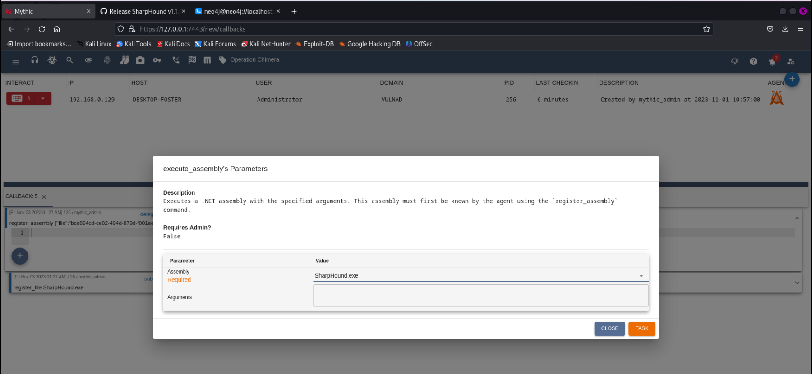

# Setting up and finding vulnerabilities Active Directory

This project involved setting up an Active Directory environment on a Proxmox server with a Windows 2022 Domain Controller and a Windows 10 workstation. The objective was to deliberately test and identify vulnerabilities within the Active Directory infrastructure.

After configuring the Active Directory, I ran a script to increase the Domain Controller's susceptibility to vulnerabilities, allowing for controlled security testing.

Utilizing tools such as 'Kerbrute' in Kali Linux, the project successfully identified potential security gaps by retrieving user credentials from the Domain Controller.

Incorporating Mythic as a command-and-control framework(C2), tools like BloodHound and SharpHound were used to gather critical data from the Domain Controller. This data was then analyzed in BloodHound to uncover vulnerabilities and potential points of exploitation.

# Infrastructure Setup:

1. **Choice of Virtualization Platform:** You can establish the Active Directory environment using various platforms like VirtualBox, VMware, or, in this case, Proxmox. I used a Proxmox server for the setup.
2. **Components:** Deploy a Windows 2022 Domain Controller and a Windows 10 workstation.

   

# Configuring Active Directory:

1. **Domain Controller Configuration:** Start by installing Active Directory Domain Services on the Windows Server through Server Manager. Set up a new forest and define a root domain name.
2. **Workstation Connection:** Configure the Windows 10 workstation to connect to the Active Directory environment.

   

# Intentionally Making the Domain Controller Vulnerable:

The setup involves implementing controlled vulnerabilities within the Domain Controller to examine its susceptibility to various attacks and security breaches.

 1. **Vulnerability Script:** A script from a specified GitHub repository (link: https://github.com/safebuffer/vulnerable-AD) is used to increase the vulnerabilities within the Domain Controller environment and setup the enviroment with random users.

Once the Domain Controller environment is made vulnerable, the following steps involve exploitation and security testing:

1. **User Enumeration:** Utilize 'Kerbrute' to enumerate users, requiring a user list available from [kerberos_enum_userlists](https://github.com/attackdebris/kerberos_enum_userlists).
2. **Password Discovery:** Using 'Kerbrute,' attempt to discover passwords for identified users.
3. **Testing Compromised Credentials:** Use discovered credentials to authenticate services, like using 'crackmapexec' for SMB access.

   
   
   
   

# Post-Exploitation Activities:

This phase involves utilizing the gained access to further exploit the environment and maintain control:

1. **Tools for Control:** Employ specific tools like 'evil-winrm' to establish connections and control the compromised accounts.

3. **Utilizing Mythic:** Deploy the Mythic framework to create payloads and maintain access through a stable connection.

   
   
   
   
   
   
 
   
5. **Analyzing Active Directory with BloodHound:** Employ BloodHound and SharpHound tools to extract and analyze comprehensive information, uncovering intricate details about the Active Directory environment.

BloodHound is a valuable tool for comprehending Active Directory relationships and potential vulnerabilities:

- **Using BloodHound:** Start a Neo4j server, login, and upload information gathered by SharpHound. Analyze the relationships using BloodHound.

BloodHound aids in visualizing intricate relationships within the Active Directory environment, benefiting both attackers and defenders in identifying and managing complex attack paths and privilege relationships.

   
   

